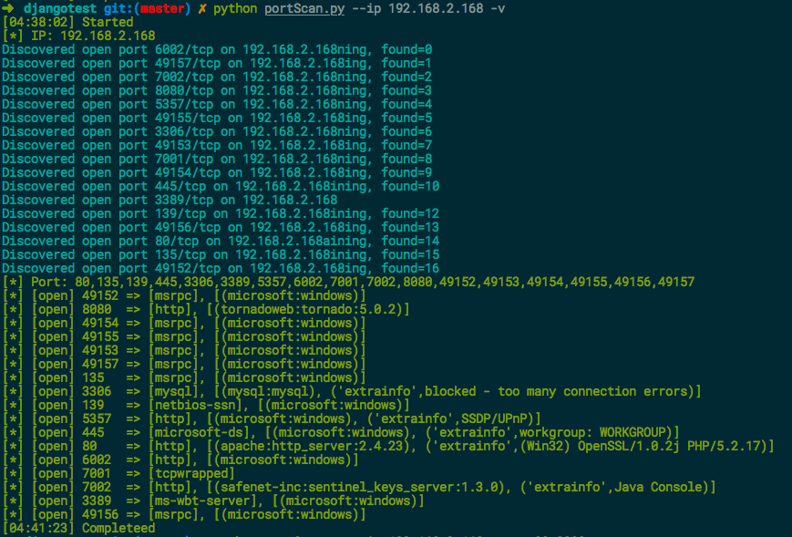

# Python端口指纹识别插件分析   
[](https://www.python.org/)   


### 0x00 前言
BugScan是一款非常好的扫描器！     
通过T00ls论坛版主的w9scan扫描器看到了端口指纹识别插件的源码，这个插件应该是BugScan官方写的，仔细看了下，将从这个插件中学到的知识总结一下，作为笔记。   


### 0x01 介绍
这个插件的位置在：w9scan/plugins/ip/find_service.py   
通过阅读这个插件的代码，才发现这个插件的设计之美，如果稍加修改，可以提取出来作为单独的文件运行。    
我将这个插件与masscan联动组合到了一起:   

* 1.先调用masscan扫描端口，正则提取出端口   
* 2.端口指纹识别   
* ~~3.再调用对应服务的未授权和弱口令检测插件~~   

默认会调用masscan扫描所有端口, 指纹识别默认启动20个线程，识别速度也不算慢，试试就知道了。    


### 0x02 分析
这个插件的每种服务类型的指纹识别都有特定的函数运行，比如检测Sql Server服务就用mssqlServer，rdp服务就用rdpServer函数。   

这些函数分两类:   
* 调用socket模块去连接端口时，对端会主动发送回来一些数据，比如SSH、smtp、FTP、MySQL、VNC，这些服务返回的数据中会带有服务特有的Banner，比如 ssh服务返回的Banner中前几个字符是固定的：SSH-，MySQL服务返回的Banner中包含版本及mysql_native_password字样等。    
* 需要主动向对端端口发送一些协议特定的数据才能从响应中判断该端口运行的是什么服务，比如HTTP，我们需要发送HTTP协议特定格式的数据（'GET / HTTP/1.1\r\nHost: %s \r\n\r\n' % remote_server'）     


### 0x03 废话少说   
##### Usage:   
```
python portScan.py 192.168.2.168
```
##### Example:   
   


### TODO
* 支持多ip或ip段检测
* 支持弱口令和未授权检测